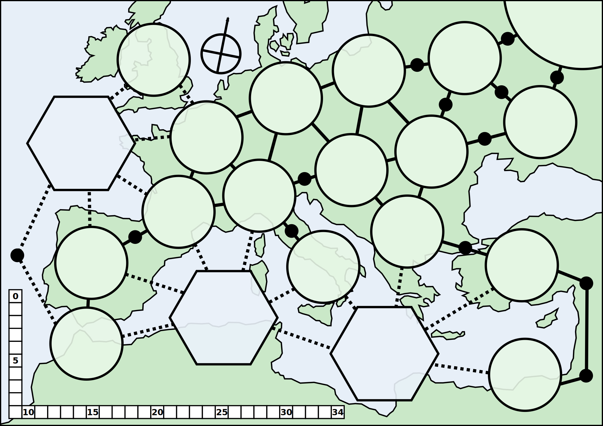

# Rulebook

## Introduction
A card-driven game about the Napoleonic Wars.

As Napoleon, bring Europe under your thumb. As the Coalition, keep Napoleon in
check without going broke.

## Components
- One 22"x17" map of Europe and the surrounding area.
- Two decks of cards.
- Markers for each country's national will / resources.
- Markers for infantry / cavalry / artillery divisions.

### The Map
- Twenty areas.

### The Cards
- 2 to 6 ops. Weather icon on 2 (1 step worse) and 5 (1 step better).
- Map cards: rivers, villages, cities. Each has a fixed mark for the defender's
  position (so the defender's standee can remain on the strategic map), while
  attackers (and reinforcements) are placed on the card in their tactical
  position.
- Leader cards: used to split armies.
  * Some leaders are generic.
  * More leaders in the French deck, on lower ops cards.
  * When a leader's army is routed, roll (draw a card) to see if they escape.
- Event cards: for various bits of chrome. (Louisiana Purchase, for instance.)

### National Will
- Most nations spend will when they rest (because you're not making forward
  progress).
- Britain gains will when they rest, from colonial income. (France can attempt
  to change this.)
- 0 will drives your country out of the war.
- Britain can give their will (resources) to coalition members.
- Some threshold of will activates nations (Prussia / Russia / Austria / etc.)
  as part of the coalition.

### The Forces
- These are used for battle actions.
- They might also be strength points / manpower, but cubes might be better for
  that.

## Terminology
TODO

## Setup
Choose a scenario in the playbook.

## Sequence of Play
On your turn, activate a leader or regroup.

### Activate
Choose a leader and play a card for ops. Move that leader on the map.

- Strategic movement: each dot costs an OP to traverse. You must stop once
  reaching a new area.
- Engage to start a battle: play a terrain card from your hand to their leader.
  They may respond by playing ops (based on the terrain card) to refuse battle
  or position the attacker. Otherwise, you position yourself on the card.
- Engage to join a battle: place yourself on an already-played terrain card.
- Disengage: Attempt to leave a battle. Any attacker can play a higher-ops card
  to block you. Cavalry can be spent to add to a card's ops for this purpose.
- Fight: Spend a chit from an engaged leader (instead of a card), and draw from
  your deck at random to determine the result.

### Regroup
Clear out the cards played to each leader. For disengaged leaders, clear out
all their cards. For engaged leaders, clear out a single card and recover any
spent chits.

## Strategy Cards

## Movement

## Reinforcements

## Battles

## Political Control

## Seasons and Weather

## The Coalition

## Victory

# Playbook

## Full Campaign (1790 to 1815)
TODO

## 1805 Scenario (The Third Coalition)
- Fr. General Napoleon and 200k in Northern France.
- Au. General Mack and 200k in the Black Forest.
- Ru. General Kutusov and 100k in Russia.

## 1806 Scenario (The Fourth Coalition)
TODO

## 1809 Scenario (The Fifth Coalition)
TODO

## 1813 Scenario (The Sixth Coalition)
TODO

## 1815 Scenario (Waterloo)
TODO
